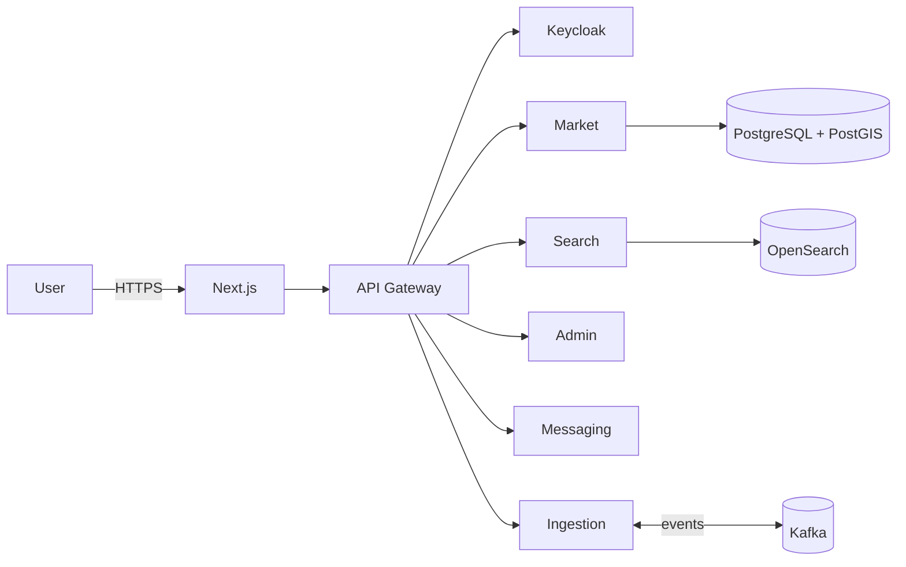

# AfroMarket — Architecture technique (BETA)

**Version** : 0.9 (Draft)
**Date** : 2026-02-11
**Stack** : Front — React 19 + Next.js 15 + TS · Backend — .NET 10 microservices · Search — OpenSearch · DB — PostgreSQL+PostGIS · IAM — Keycloak · Bus — Kafka

## 1. Vision
Annuaire géolocalisé de commerces africains au Canada, centré sur la **recherche** (full-text + géo + facettes), modération de contenus et ingestion de sources externes.

## 2. Vue d'ensemble
- Front SSR/ISR (Next.js) pour SEO & vitesse
- API Gateway (CORS, rate-limit), services .NET 10 (Market, Search API, Admin, Messaging, Ingestion)
- OpenSearch comme moteur principal de recherche
- PostgreSQL source-of-truth, indexation event-driven (Kafka)



## 3. Domaines
- **Recherche** : OpenSearch (analyzers FR, geo_point, facettes)
- **Commerce** : CRUD commerces + **marchandises (produits)**, statuts `draft|pending_validation|published/active|suspended`
- **Admin** : modération/validation, audit
- **Ingestion** : connecteurs externes, normalisation, déduplication
- **Messagerie** : contact (captcha/rate-limit), notifications e-mail

## 4. Modèle (extrait)
```mermaid
erDiagram
  USER ||--o{ BUSINESS : owns
  BUSINESS ||--o{ ITEM : offers
  BUSINESS ||--o| ADDRESS : located

  ITEM {
    uuid id
    uuid business_id
    text title
    text description
    money price
    text currency
    text status // draft|pending_validation|active|suspended
  }
```

## 5. API (extraits)
- `GET /api/search?q=&category=&lat=&lon=&radius=`
- `GET /api/businesses/{slug}`
- `POST /api/merchants/businesses` (draft)
- `POST /api/merchants/items` (créer une marchandise)
- `PUT /api/merchants/items/{id}`
- `POST /api/admin/businesses/{id}/validate`
- `POST /api/admin/items/{id}/validate`

## 6. NFR
p95 recherche < 300 ms (hors réseau) • 99.5% BETA • Observabilité OTel→ELK/Grafana • Sécurité OIDC RBAC • CI/CD Blue-Green
